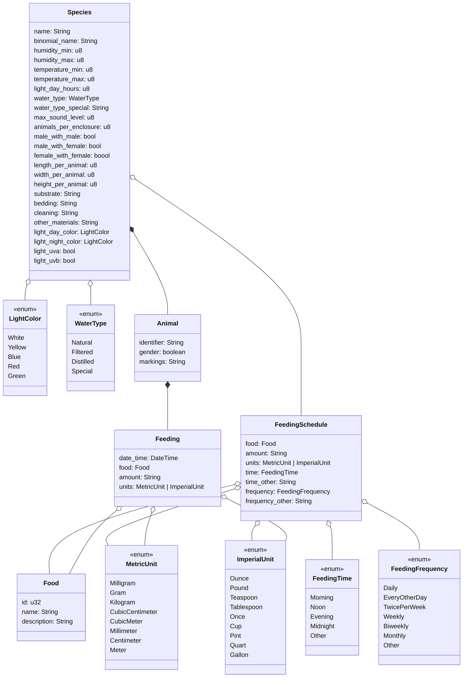

# Classes

```mermaid
classDiagram
	class LightColor {
		<<enum>>
		White
		Yellow
		Blue
		Red
		Green
	}

	class WaterType {
		<<enum>>
		Natural
		Filtered
		Distilled
		Special
	}

	class Species {
		name: String
		binomial_name: String
		humidity_min: u8
		humidity_max: u8
		temperature_min: u8
		temperature_max: u8
		light_day_hours: u8
		water_type: WaterType
		water_type_special: String
		max_sound_level: u8
		animals_per_enclosure: u8
		male_with_male: bool
		male_with_female: bool
		female_with_female: boool
		length_per_animal: u8
		width_per_animal: u8
		height_per_animal: u8
		substrate: String
		bedding: String
		cleaning: String
		other_materials: String
		light_day_color: LightColor
		light_night_color: LightColor
		light_uva: bool
		light_uvb: bool
	}

	class Food {
		id: u32
		name: String
		description: String
	}

	class FeedingTime {
		<<enum>>
		Morning
		Noon
		Evening
		Midnight
		Other
	}

	class FeedingFrequency {
		<<enum>>
		Daily
		EveryOtherDay
		TwicePerWeek
		Weekly
		Biweekly
		Monthly
		Other
	}

	class MetricUnit {
		<<enum>>
		Milligram
		Gram
		Kilogram
		CubicCentimeter
		CubicMeter
		Millimeter
		Centimeter
		Meter
	}

	class ImperialUnit {
		<<enum>>
		Ounce
		Pound
		Teaspoon
		Tablespoon
		Once
		Cup
		Pint
		Quart
		Gallon
	}

	class FeedingSchedule {
		food: Food
		amount: String
		units: MetricUnit | ImperialUnit
		time: FeedingTime
		time_other: String
		frequency: FeedingFrequency
		frequency_other: String
	}

	class Feeding {
		date_time: DateTime
		food: Food
		amount: String
		units: MetricUnit | ImperialUnit
	}

	class Animal {
		identifier: String
		gender: boolean
		markings: String
	}

	Species o-- LightColor
	Species o-- WaterType
	Species o-- FeedingSchedule

	FeedingSchedule o-- Food
	FeedingSchedule o-- MetricUnit
	FeedingSchedule o-- ImperialUnit
	FeedingSchedule o-- FeedingTime
	FeedingSchedule o-- FeedingFrequency

	Species *-- Animal

	Animal *-- Feeding

	Feeding o-- Food
	Feeding o-- MetricUnit
	Feeding o-- ImperialUnit

```
