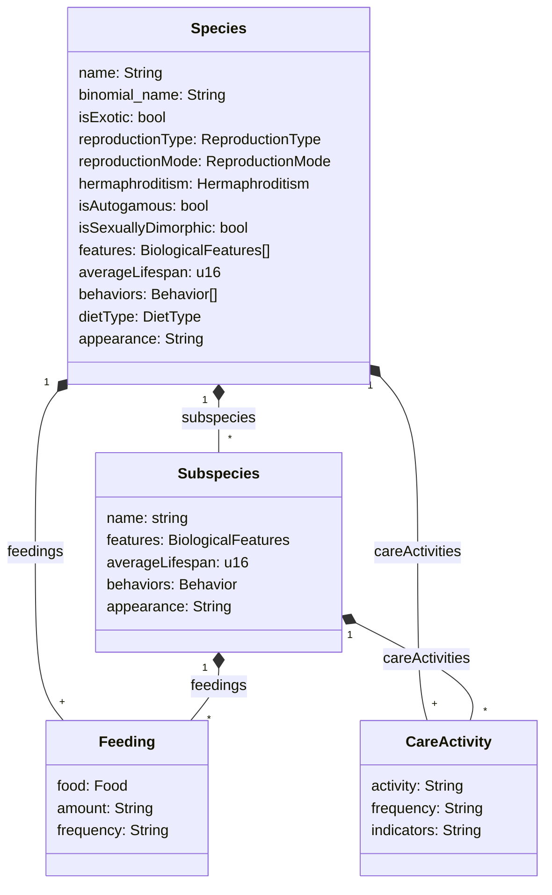

# Class Diagram

## Reproduction

### Types

- Asexual
- Sexual
- Asexual and Sexual
- Other

### Mode

- Eggs
	+ Externaly fertalized, externally developed
	+ Internally fertalized, externally developed
	+ Internally fertalized, internally develop
- Zygotic
	+ Derives nutrients from surrounding tissue
	+ Placental
	+ Marsupial
- Other

### Hermaphroditism

- None
- Serial
- Fixed

## Features

### Integuments

- Exoskeleton
- Skin
- Hair
	+ Hair
	+ Fur
		* Guard Hair
		* Down Hair
- Scales
- Scutes
- Feathers
- Hooves
- Claws
- Nails

### Sensory

- Eyes
	+ Simple
	+ Compound
- Ears
- Nose
- Tongue
- Antennae
- Magnetoreceptor
- Whiskers

### Limbs

- Fins
- Arms/Legs
- Hands/Feet
- Fingers/Toes
	+ Dewclaw
- Wings
- Patagia
- Tail
	+ Simple
	+ Pseudoprehensile
	+ Prehensile

### Reproductive

- Gonads
- Penis
- Vagina
- Cloaca

### Endocrinological

- Scent Glands
- Mammary glands

### Other

- Teeth

## Behaviors

- Prey drive
- Digging
- Swimming
- Coprophagia
- Vocalization
	+ Barking
	+ Meowing
	+ Howling
	+ Growling
	+ Whining
	+ Yipping
- Posturing
	+ Sexual
	+ Aggressive
	+ Solicitous
	+ Comforting
		* Self-soothing
		* Empathic
	+ Submissive
- Urinating/Marking
- Belly exposure
	+ Defensive
	+ Solicitous
- Herding
- Foraging
- Gliding
- Running
- Tracking
- Retrieving
- Chasing
- Play
	+ Wrestling
	+ Tug-of-war

## Diet

### Type

- Obligate carnivore
- Primary carnivore
- Omnivore
- Primary herbivore
- Obligate herbivore
