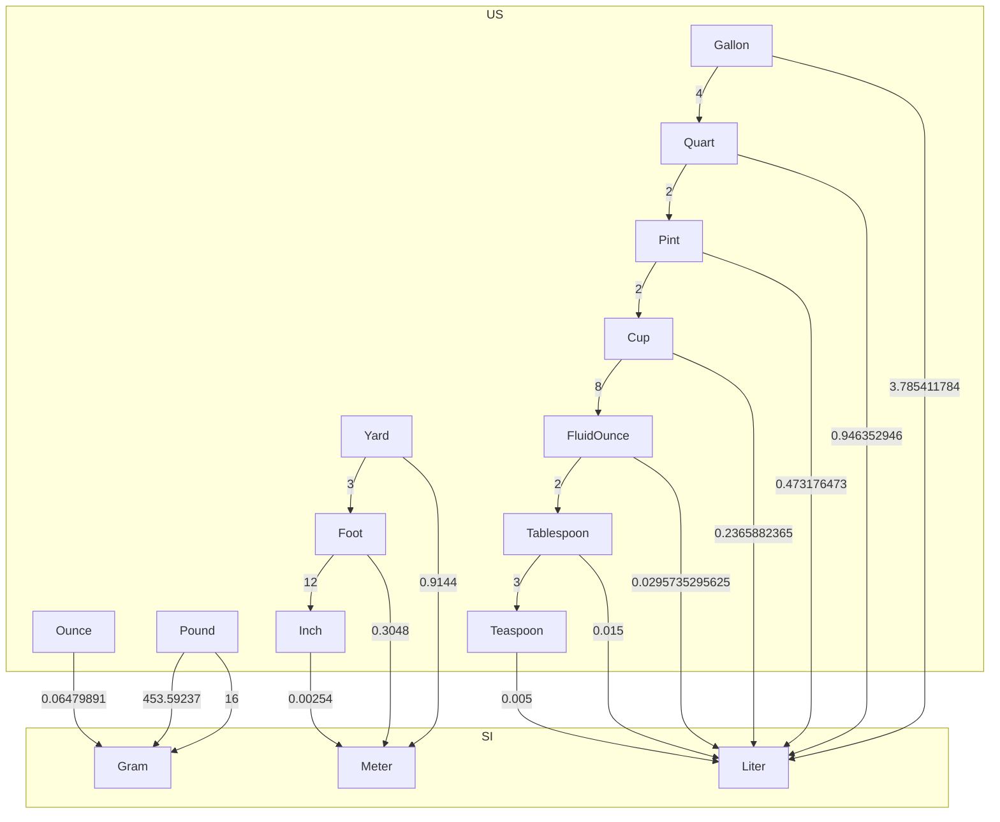

# Units of Measure

```mermaid
graph TB
	subgraph SI
		Gram
		Meter
		Liter
	end

	subgraph US
		Ounce
		Pound
		Inch
		Foot
		Yard
		Teaspoon
		Tablespoon
		FluidOunce
		Cup
		Pint
		Quart
		Gallon
	end

	Inch -- 0.00254 --> Meter
	Foot -- 12 --> Inch
	Foot -- 0.3048 --> Meter
	Yard -- 3 --> Foot
	Yard -- 0.9144 --> Meter

	Ounce -- 0.06479891 --> Gram
	Pound -- 453.59237 --> Gram
	Pound -- 16 --> Gram

	Teaspoon -- 0.005 --> Liter
	Tablespoon -- 0.015 --> Liter
	Tablespoon -- 3 --> Teaspoon
	FluidOunce -- 0.0295735295625 --> Liter
	FluidOunce -- 2 --> Tablespoon
	Cup -- 0.2365882365 --> Liter
	Cup -- 8 --> FluidOunce
	Pint -- 0.473176473 --> Liter
	Pint -- 2 --> Cup
	Quart -- 0.946352946 --> Liter
	Quart -- 2 --> Pint
	Gallon -- 3.785411784 --> Liter
	Gallon -- 4 --> Quart
```
